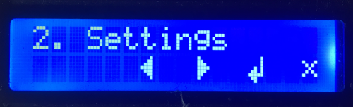

# mbLib
Library for microcontroller projects with helper funtions and classes.

- **How to use it**
- **MBMenu** create menu for LCD
- **MBHelper** read string from progmem, format time as string, ...

# How to use it
1. Go to arudino library folder and clone from github:
```
> cd myPathTo/Arduino/libraries
> git clone https://github.com/mchlbrnhrd/mbLib
```
2. Open Arduino IDE and execute one of following example codes.
```
File->Examples->mbLib->menuExampleLCD
File->Examples->mbLib->menuExampleSerial
```
3. Connect Arduino board (e.g. Arduino Uno), compile and upload code.
4. Open serial monitor and type _l_ for left, _r_ for right, _e_ for enter and _x_ for exit. Typing _m_ shows the menu. (Hint: After typing key press \<Enter\>)

# MBMenu

Class to create menu for liquid crystal display (LCD). Designed for easy use.
First setup menu by adding nodes with _addNode_ method. There you set the text to display, the layer and a function ID (FID).
To navigate in the menu just call _right()_, _left()_, _enter()_ and _exit()_. Then you get the FID and you can take action by calling functions for example.
* **addNode(text, layer, functionID)**: add new menu entries/nodes
* **buildMenu()**: menu is built
* **printMenu()**: show complete menu via serial monitor (terminal)
* **left()**, **right()**, **enter()**, **exit()**: navigate through menu


 
Once you implemented the basic code like in the following example it is easy to change the menu or add further nodes.
 
## Example

Menu should look like:

| entry | layer |
|-------|-------|
|1. Foo | 0 |
|&nbsp;&nbsp;1.1 FooA| 1|
|&nbsp;&nbsp;1.2 FooB|1|
|&nbsp;&nbsp;&nbsp;&nbsp;&nbsp;&nbsp;1.2.1 Test1|2|
|&nbsp;&nbsp;&nbsp;&nbsp;&nbsp;&nbsp;1.2.2 Test2|2|
|2. Bar|0|
|&nbsp;&nbsp;2.1 BarA|1|
  
Complete examples here: [menuExampleLCD.ino](examples/menuExampleLCD/menuExampleLCD.ino) and
[menuExampleSerial.ino](examples/menuExampleSerial/menuExampleSerial.ino)

Summarized the main parts of the code:
```C++  
#include <CMBMenu.hpp>

CMBMenu<100> g_Menu;

void setup()
{
  g_Menu.addNode(0, MenuFoo_pc , MenuFoo);
  g_Menu.addNode(1, MenuFooA_pc, MenuFooA);
  g_Menu.addNode(1, MenuFooB_pc, MenuFooB);
  g_Menu.addNode(2, MenuTest1_pc, MenuTest1);
  g_Menu.addNode(2, MenuTest2_pc, MenuTest2);

  g_Menu.addNode(0, MenuBar_pc, MenuBar);
  g_Menu.addNode(1, MenuBarA_pc, MenuBarA);
  
  const char* info;
  g_Menu.buildMenu(info);
  g_Menu.printMenu();
  printMenuEntry(info);
}

void loop()
{
  // ...
  int fid = 0;

  // determine pressed key
  KeyType key = getKey();

  // call menu methods regarding pressed key
  switch(key) {
    case KeyRight:
      g_Menu.right();
      break;
    case KeyLeft:
      g_Menu.left();
      break;
    // ...
    default:
      break;
  }
  
  // pint/update menu when key was pressed
  // and get current function ID "fid"
  if (KeyNone != key) {
    fid = g_Menu.getInfo(info);
    printMenuEntry(info);
  }

  // do action regarding function ID "fid"
  if ((0 != fid) && (KeyEnter == key) && (!layerChanged)) {
    switch (fid) {
      case MenuFooA:
        FooA();
        break;
      case MenuBarA:
        BarA();
        break;
      case MenuTest1:
        Test1();
        break;
      case MenuTest2:
        Test2();
        break;
      default:
        break;
    }
  }
}
```
Here terminal output example:<br>


# MBHelper
Helper functions:
* void stringFromPgm(const char* f_StringPgm_pc, String& f_Value);<br>
  _get string from progmem (PGM)_
* void lcdCharArrayFromPgm(const uint8_t* f_Pgm_pc, uint8_t* f_Value);<br>
  _get char array from progmem (PGM)_
* void formatTime(unsigned long f_Seconds, String& f_Result);<br>
 _format time out from "seconds": h:mm:ss_ example: **135s** => **0:02:15**
* void formatTimeMillis(unsigned long f_Milliseconds, String& f_Result);<br>
_format time out from "milliseconds": h:mm:ss.ms_
* void formatInt(int f_Value, int f_Length, String& f_Result);<br>
_format integer_
